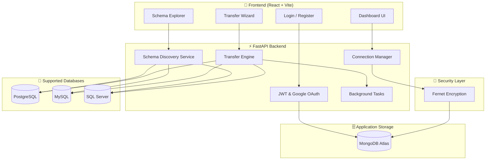

# | Data Connectivity & Transfer Platform

<div align="center">

### Secure Database Connectivity, Schema Exploration & High-Performance Data Migration

[](https://www.docker.com/)
[](https://fastapi.tiangolo.com/)
[](https://react.dev/)
[](https://www.mongodb.com/)
[](https://tailwindcss.com/)

</div>

---

## 📖 Executive Summary

**Data Connectivity ** is an enterprise-grade data management platform designed to bridge the gap between complex database infrastructures and intuitive user operations. It provides a centralized hub for developers and data engineers to securely connect to diverse relational databases, explore complex schemas with visual clarity, and execute high-performance data migrations across systems.

Built with a focus on **Visual Excellence** and **Operational Security**, Datafly combines a high-performance FastAPI back-end with a premium, modern React front-end inspired by the design languages of Vercel and Stripe.

---

## 🏗️ System Architecture

Datafly follows a decoupled, service-oriented architecture designed for scalability and security.



---

## ✨ Premium Features

### 🔌 Intelligent Connectivity
- **Multi-Engine Support**: Seamlessly connect to PostgreSQL, MySQL, and SQL Server.
- **Credential Encryption**: All database credentials are encrypted using Fernet (AES-128/256) before being stored in MongoDB Atlas.
- **Connection Health Monitoring**: Real-time heartbeat checks to ensure database availability.

### 🗂️ Advanced Schema Discovery
- **Visual Meta-data Browser**: Explore tables, columns, and data types without writing a single line of SQL.
- **Deep Inspection**: View detailed column properties and foreign key relationships (in progress).

### 🚀 High-Performance Transfer Engine
- **Source-to-Target Mapping**: Flexible column mapping allows you to rename or skip columns during migration.
- **Batch Processing**: Optimized record fetching and insertion using SQLAlchemy Core for high throughput.
- **Real-time Progress Tracking**: Monitor transfer progress row-by-row through a dedicated dashboard.
- **Resilient Execution**: Managed background tasks that continue even if the browser session is closed.

### 🎨 Modern UX/UI
- **High-Contrast Design**: A "Premium Dark/Light" interface utilizing Tailwind CSS for a sleek, professional look.
- **Dynamic Interactions**: Smooth transitions and micro-animations powered by Framer Motion.
- **Responsive Layout**: Native-feel experience across desktops, tablets, and mobile devices.

---

## 🛠️ Technology Stack

| Component | Technology | Rationale |
| :--- | :--- | :--- |
| **Frontend** | React 18, Vite | For lightning-fast HMR and reactive state management. |
| **Styling** | Tailwind CSS | Utility-first approach for consistent, premium design tokens. |
| **Icons** | Lucide React | Clean, scalable vector icons consistent across the UI. |
| **Backend** | FastAPI | High-performance asynchronous API framework for Python. |
| **DB (Application)** | MongoDB Atlas | Flexible document storage for connection metadata and logs. |
| **DB (Drivers)** | SQL Alchemy | Robust ORM/Core for cross-database compatibility. |
| **Auth** | JWT & Google OAuth | Industry-standard secure identity management. |
| **Deployment** | Docker & Nginx | Containerized for easy scaling and environment parity. |

---

## 📂 Project Repository Analysis

The repository is structured for maximum maintainability and clear separation of concerns.

```text
.
├── frontend/             # React application (Vite-powered)
│   ├── src/
│   │   ├── components/   # Reusable UI components (Modals, Charts, Sidebars)
│   │   ├── pages/        # Main application views (Dashboard, Transfer, History)
│   │   ├── api/          # Axios instance and API call definitions
│   │   └── utils/        # Helper functions and formatters
├── backend/              # FastAPI application
│   ├── app/
│   │   ├── api/          # Route handlers (Controllers)
│   │   ├── core/         # Config, Security, and JWT logic
│   │   ├── models/       # Data models (Pydantic & MongoDB schemas)
│   │   ├── services/     # Business logic (Transfer Engine, DB Discovery)
│   │   └── db/           # Database session and connection logic
├── docker-compose.yml    # Full-stack container orchestration
└── nginx/                # Proxy configuration for production
```

---

## 🚀 Deployment & Installation

### Prerequisite: Environment Configuration
Create a `.env` file in the `/backend` directory:
```env
SECRET_KEY=your-secure-secret-key
ENCRYPTION_KEY=your-fernet-encryption-key
MONGO_URI=mongodb+srv://...
MONGO_DB_NAME=datafly
GOOGLE_CLIENT_ID=...
```

### Option 1: Docker (Recommended)
Launch the entire stack with a single command:
```bash
docker-compose up --build
```
- **Frontend**: `http://localhost:5173`
- **Backend API**: `http://localhost:8000`
- **API Documentation**: `http://localhost:8000/docs`

### Option 2: Manual Setup

**Backend Deployment:**
```bash
cd backend
python -m venv venv
source venv/bin/activate  # or venv\Scripts\activate on Windows
pip install -r requirements.txt
uvicorn app.main:app --reload
```

**Frontend Deployment:**
```bash
cd frontend
npm install
npm run dev
```

---

## 🛡️ Security Architecture

1. **Authentication**: All protected routes require a Bearer JWT token.
2. **Authorization**: User-specific data access ensures one user cannot see another's database connections.
3. **Data Protection**: Sensitive database passwords are encrypted at rest using a unique `ENCRYPTION_KEY`.
4. **CORS Policy**: Configurable origins to prevent unauthorized domain access.

---

## 👨‍💻 Project Lead

**Lathusan Shanmuganathan**
*Full-Stack Engineer specialized in Data Connectivity Systems*

- **Email**: [lathusanlathusan40@gmail.com](mailto:lathusanlathusan40@gmail.com)
- **LinkedIn**: [linkedin.com/in/lathusan](https://linkedin.com/in/yourprofile)
- **GitHub**: [github.com/SanmuganathanLathusan](https://github.com/SanmuganathanLathusan)

---

<div align="center">

### ⭐ Innovation in Data Portability
Developed for high-performance data migration and secure database exploration.

</div>
